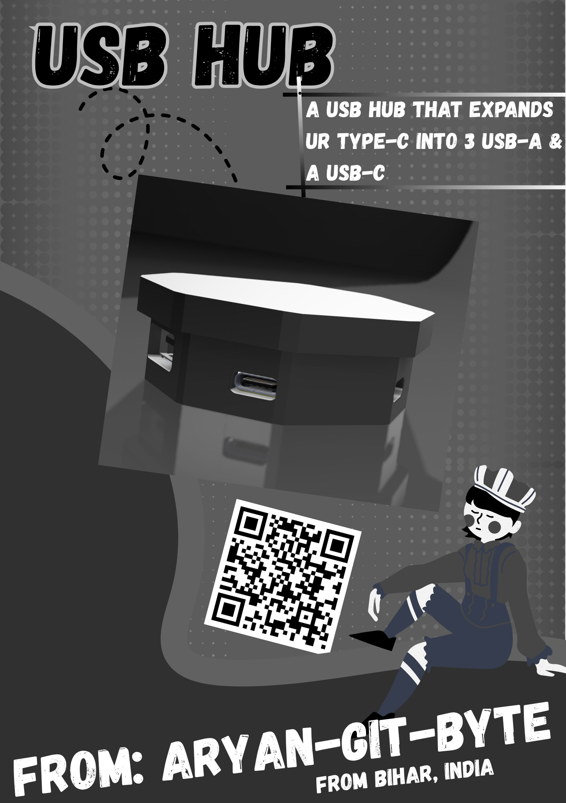
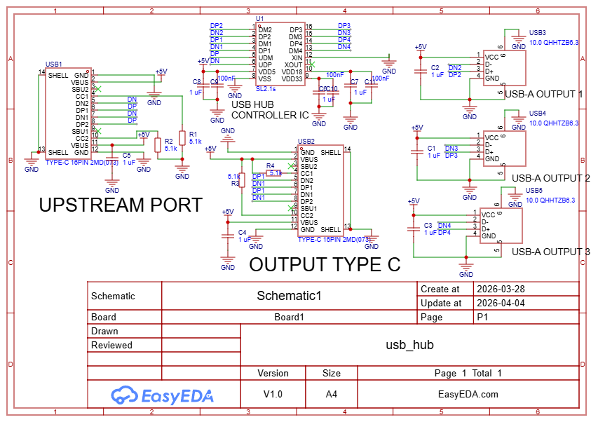
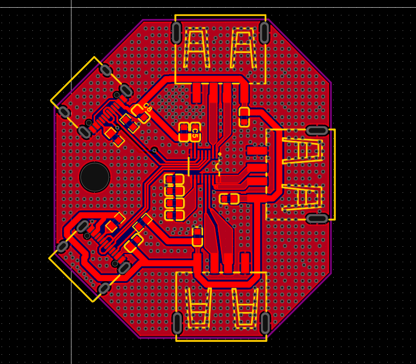
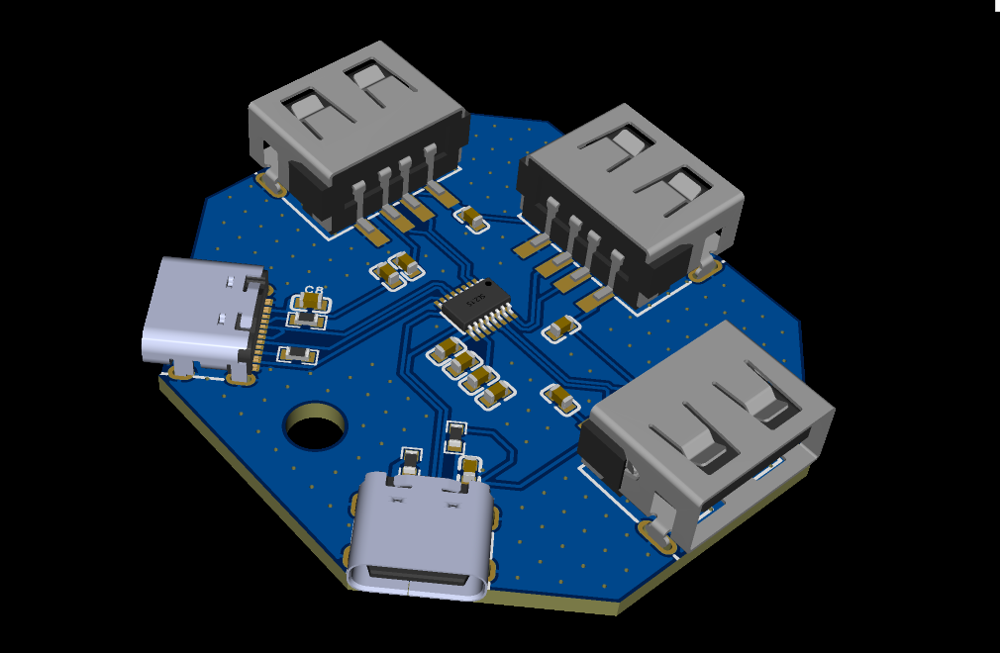
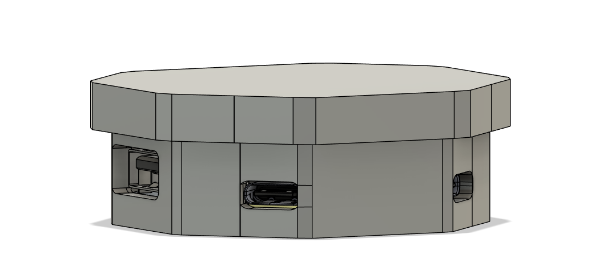
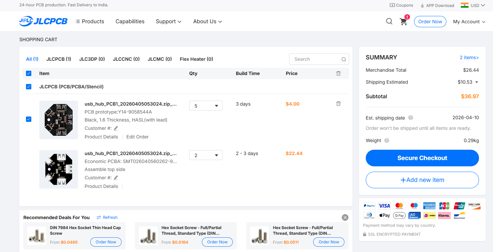

# Overview:

# What is this:
Hi, This is a USB-hub that can expand one 1 USB into 3x 2.0 USB-A, &  1x 2.0 USB-C.
it is a very compact pocket-friendly USB-hub that you can carry around with yourself easily.
I made this project because i wanted to learn about USB expander and wanted to DIY one.

# Application:
Personally i wanted to play minecraft on phone with keyboard & mouse. but since it has only 1 port , i couldn't + my potato laptop cant run it :(.

# Schematic Overview:

Starting off it has a usb-c input port, which goes to the usb-hub ic and further on which outputs 1x USB-C, and 3x USB-A.

# PCB Overview:

you can see the routing & layout of the PCB in this image.

# Case Overview:

This is the Case of the PCB, which will hold the pcb in it. also this isnt final yet , like i m bit unsure about the dimensions. so i will update this after pcb arrives, and i actually measure it and fine tune the parameters.

# Cart:

# BOM:

|Item no. | Name | price | link | 
|---------|------|-------|------|
|1.|1 uf ceramic cap x 8|0.32 usd each |https://www.lcsc.com/product-detail/C29936.html?s_z=n_0603%25201%2520uf%2520cer|
|2| 100 nf ceramic x 3| 0.3 usd each | https://www.lcsc.com/product-detail/C14663.html?s_z=n_0603%2520100%2520nf%2520ceramic
|3| 5.1 k resistor x 4 | 0.12 usd each | https://www.lcsc.com/product-detail/C2907044.html?s_z=n_0603%25205.1k%2520resistor%2520
|4|SL2.1s x 1 | 1.13 usd | https://www.lcsc.com/product-detail/C2684433.html?s_z=n_SL2.1s%2520
|5|TYPE-C 16PIN 2MD(073)| 1.27 usd | https://www.lcsc.com/product-detail/C2765186.html?s_z=n_TYPE-C%252016PIN%25202MD%28073%29
|6| 10.0 QHHTZB6.3 |0.63 usd | https://www.lcsc.com/product-detail/C668591.html?s_z=n_10.0%2520QHHTZB6.3

this is the total expense of the project which breakdowns to:
- 4 usd for the PCB
- 22.44 usd for the PCBA
- 10.53 usd for the shipping which is E-Post
